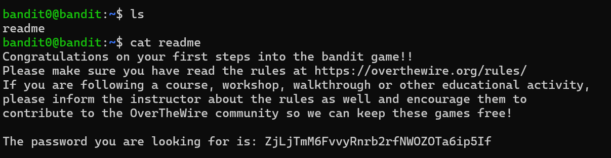
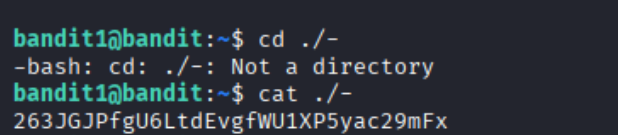
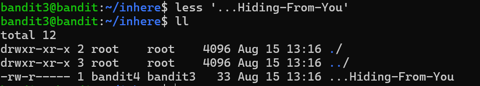
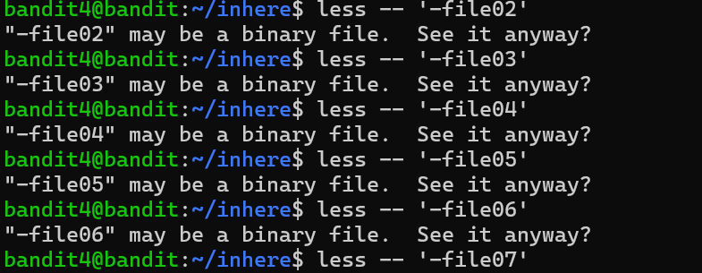
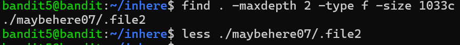
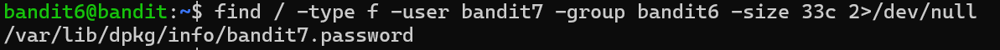
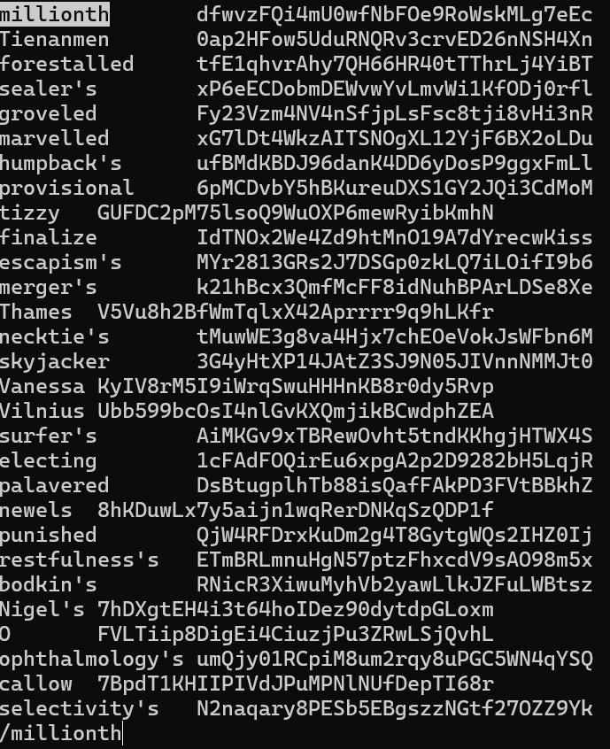
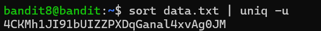
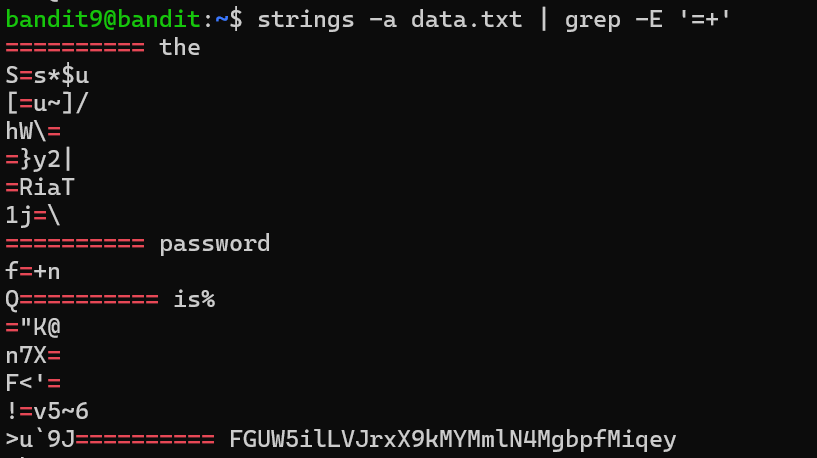
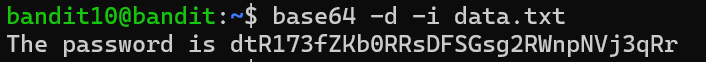

# level0->level10
## level0
测试ssh连接：ssh -p 2220 bandit0@bandit.labs.overthewire.org
## level0->level1

## level1->level2

使用./保护文件名（cd - 表示上次cd）
## level2->level3

--表示后面没有参数，""用来保护文件完整（''也可以）
## level3->level4

ll寻找隐藏的文件
## level4->level5

枚举寻找可读文件
## level5->level6

使用find函数，maxdepth表示搜索深度
## level6->level7

2>dev/null是将错误重定向
## level7->level8

在less窗口输入/再输入字符串和回车可以定位，用n和N向下或向上搜索
## level8->level9

sort先排序uniq再筛选，-u参数表示只出现过一次
## level9->level10

strings命令用于从二进制文件中提取可打印的字符串，-a表示整个文件，grep正则进行匹配
## level10->level11

使用base64（密文位数是4的倍数，有=）解码，-d,解码数据,-i,在解码时，忽略非字母表字符（即丢弃非法 Base64 字符）